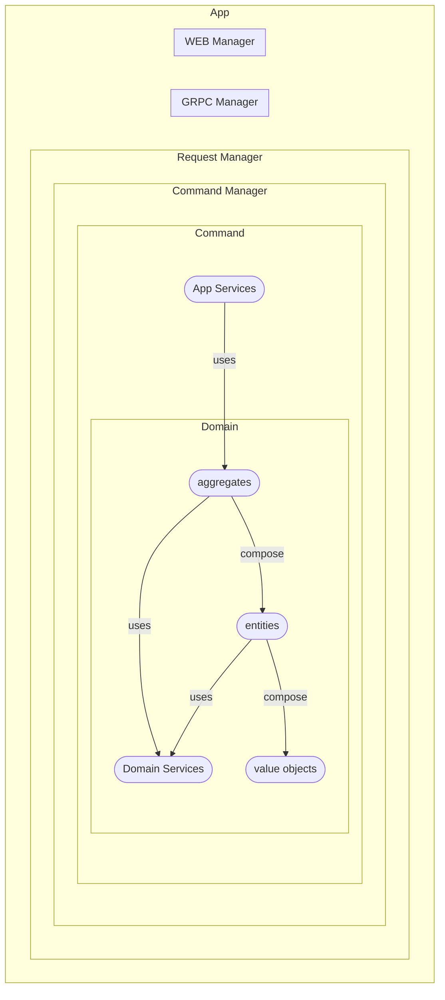

# Todo

## Description

A todo list implementation as an excuse to explore building Go microservices and micromonoliths based on DDD practices.

The real advantage of this approach may not be visible in small service projects or those that do not require maintenance or extension in the long term, but it notoriously simplifies the addition of new business features on a consistent basis. On the other hand, as the implementation is defined in real business terms (ubiquitous language) and consequently freed from needing to adjust directly to a REST model (*), the code navigation and discovery becomes more natural.

Some choices may seem overly ceremonial within the Go ecosystem, particularly when trying to employ them in a trivial example such as the one proposed here but the intention is to use it as a reference to later create a generator utility based on those patterns.

Request processing in a more RESTy way will be also considered if required (i.e .: during signin, signout, etc.).

This is a proof of concept, needs some polishing and tests implementation.

(*) A REST adapter can still make use of these commands and queries but now GET and POST requests will be enough the only meaningful information in the URL will be the name of the command to be executed or a suitable mapping. Also API documentation (OpenAPI) becomes more humanly understandable [TODO: show an example], this especially to people with less technical background.

Testing is also simplified since we are isolated from infrastructure issues (http, grpc, etc).

Finally it is possible to manually send queries and commands from console if required since it is trivial to create a CLI adapter that operates on the elements of the bounded context. This can be particularity useful during development stage.

## Structure

[WIP] This is a very basic rough draft, it's more of a placeholder for the actual chart (does GitHub render Mermaid?)

## Notes

* There are a couple of type assertions associated with command processing that don't seem quite fancy. See how to avoid them.

* Directory nesting to organize package definitions can be cumbersome but for now it simplifies mapping concepts from DDD to code.

## Todo
* Simplify the structure if it really make some sense.
* Define the sequence of steps required to manually create a new command and associate it with driving adapters.
* Implement a gen code tool (command line) in order to simplify the creation of aggregates, entities, value objects, commands, adapters, etc.
* Define which is the most convenient way to feed this tool:
  * CLI shell arguments
  * JSON
  * YAML
  * SAML
  * TOML
  * HCL

